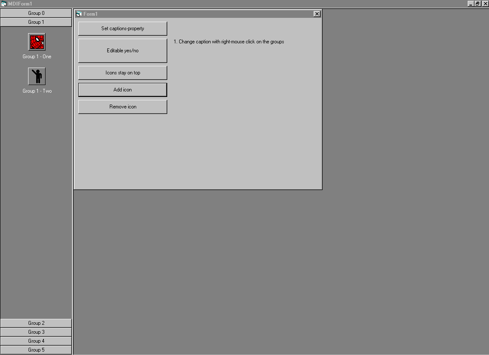



## Dynamic Buttonbar

### Description

This is almost a fully dynamic Buttonbar. This control is not finished yet... i know there are still bugs and problems. If there is enough response i will finish and put some other things in it. Still have many ideas... :)

I would also like to thank other programmers from PSC because not all of the code is from my hand.
 
### More Info
 
In the function set groups there is a call to a function NoFocusRect. Put this in comment until compilation, otherwise you can't use the stop button in vb

             |
---                |---
**Submitted On**   |2001-07-04 10:46:02
**By**             |[The Doctor](https://github.com/Planet-Source-Code/PSCIndex/blob/master/ByAuthor/the-doctor.md)
**Level**          |Advanced
**User Rating**    |4.3 (17 globes from 4 users)
**Compatibility**  |VB 6\.0
**Category**       |[Custom Controls/ Forms/  Menus](https://github.com/Planet-Source-Code/PSCIndex/blob/master/ByCategory/custom-controls-forms-menus__1-4.md)
**World**          |[Visual Basic](https://github.com/Planet-Source-Code/PSCIndex/blob/master/ByWorld/visual-basic.md)
**Archive File**   |[Dynamic Bu22180742001\.zip](https://github.com/Planet-Source-Code/the-doctor-dynamic-buttonbar__1-24712/archive/master.zip)

